# 中文教程网
博文链接：https://nextjs-docs-henna-six.vercel.app/tutorials/project-structure
# App 路由文件约定
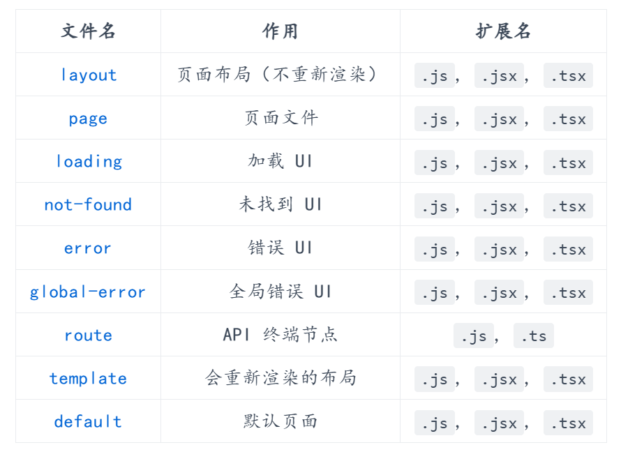
# 创建项目
```javascript
npx create-next-app@latest
```
```javascript
选择自定义安装，接下来会有几个问题需要你选择，根据你的需求选择即可
What is your project named? » my-app 项目名称（必填）
Would you like to use the recommended Next.js defaults? 是否使用推荐配置 这里我选自定义配置 No, customize settings
Would you like to use TypeScript? » No / Yes 是否使用TypeScript 这里我选是 Yes
Which linter would you like to use? » ESLint / Biome / None 是否使用ESLint 这里我选是 None
Would you like to use React Compiler? » No / Yes 是否使用React Compiler 这里我选是 Yes
Would you like to use Tailwind CSS? » No / Yes 是否使用Tailwind CSS 这里我选是 Yes
Would you like to use src/app directory? » No / Yes 是否使用src/app目录 这里我选是 Yes
Would you like to use App Router? (recommended) » No / Yes 是否使用App Router 这里我选是 Yes
Would you like to use Turbopack? (recommended) » No / Yes 是否使用Turbopack 这里我选是 Yes
Would you like to customize the import alias (@/* by default)? » No / Yes 是否自定义导入别名 @/* 这里我选是 Yes
What import alias would you like configured? » @/* 是否自定义导入别名 @/* 这里我选是 默认 @/*
选择完成之后，他会执行npm install安装依赖，安装完成之后，他会执行npm run dev启动项目，访问http://localhost:3000即可看到项目。
```
# 目录结构
```javascript
public/ -> 静态资源目录
src/ -> 源代码目录
  └─app/ -> App Router目录
     └─layout.tsx -> 跟布局(必须存在 且必须包含html body标签)
     └─page.tsx -> 首页
     └─globals.css -> 全局样式
next-env.d.ts -> TypeScript类型定义文件
next.config.ts -> Next.js配置文件
tsconfig.json -> TypeScript配置文件
postcss.config.mjs -> PostCSS配置文件(主要用于处理tailwindcss)
package.json -> 包管理文件
README.md -> 项目说明文件
```
# 命令介绍
```javascript
next dev -> 启动开发服务器 -> npm run dev
next build -> 构建项目 -> npm run build
next start -> 启动生产服务器 -> npm run start
```
# 配置React Compiler
React Compiler 是Next.js 用于自动优化组件渲染来提高性能的工具，在之前的话，我们需要手动优化useMemo / useCallback /memo等，现在Next.js会自动优化，你只需要写代码即可,减少心智负担。
## 如何开启React Compiler? （如果你在前面安装选项中选择yes，则无需安装）
```javascript
npm install -D babel-plugin-react-compiler
```
## next.config.ts
```javascript
import type { NextConfig } from "next";

const nextConfig: NextConfig = {
  /* config options here */
    reactCompiler:true
};

export default nextConfig;
```
# 什么是Turbopack？
Turbopack 是一个增量打包器，用于取代webpack,它是用Rust语言编写,并且Turbopack转换js/ts使用的是SWC,他比vite快10倍，比webpack快700倍，速度更快，性能更优。
## 核心原理
Turbopack是函数级别的缓存，可以将某些函数，进行标记，当这些函数被调用时，会记住他们被调用的内容，保存到缓存中。

首先我们看到有两个文件api.ts/ sdk.ts 都调用了readFile函数，然后把这两个文件打包成bundle,然后拼接起来,最后打成一个fullBundle
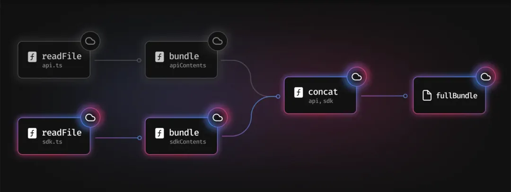
例如sdk.js发生了变化，而api.js没有改变，所以他就只会打包sdk.js,而不会打包api.js,只需要从缓存中读取api.js内容即可，这样就可以节省非常多的时间，意味着它永远不需要执行两次相同的工作。
# 路由系统
Next.js 有两套路由系统，一个是旧的Pages Router路由系统，一个是新的App Router路由系统。

Pages Router的路由系统是会把pages目录下的所有jsx/tsx文件，都转换成路由，例如pages/index.tsx会转换成/路由，pages/about.tsx会转换成/about路由，如果要把组件写到pages目录下，组件名称需要定义为_xxxxx.jsx,也就是要在前面加下划线，这样就不会被视为路由了。
## APP Router（新版路由系统）
### 目录结构
```javascript
src/
└── app
    ├── page.tsx -> / 首页
    ├── layout.tsx -> 布局组件
    ├── template.tsx -> 模板组件
    ├── loading.tsx -> 加载组件
    ├── error.tsx -> 错误组件
    └── not-found.tsx -> 404组件
    ├── xiaoman
    │   └── page.tsx -> /xiaoman 小满页面
    └── daman
        └── page.tsx -> /daman 大满页面
```
## Page Router（旧版路由系统）
### 目录结构
```javascript
 └── pages
    ├── index.ts -> /
    ├── login.tsx -> /login
    ├── api
    │   └── user.tsx -> /api/user
    ├── posts
    │   └── [id].tsx -> /posts/[id]
    └── blog
        ├── index.ts -> /blog
        └── setting.tsx -> /blog/setting
```
## 两种路由系统，数据获取的差异
### Pages Router
读取数据需要使用getServerSideProps / getStaticProps / getStaticPaths等函数
```javascript
export async function getServerSideProps() {
  const res = await fetch('xxx');
  const data = await res.json();
  return { props: { data } };
}
export default function Home({ data }) {
  return <div>{data.name}</div>;
}
```
### App Router
直接在组件中使用fetch调用即可(相当于getStaticProps)
```javascript
export default async function Home() {
  const res = await fetch('xxx');
  const data = await res.json();
  return <div>{data.name}</div>;
}
```
## 退出路由
为文件夹增加 _ 前缀，即可将该文件夹和它的所有子目录退出路由段。
> app/_user/[id]/page.jsx 不渲染

> app/_user/[id]/(profile)/page.jsx 不渲染
## layout && template
### layout(布局)
布局是多个页面共享UI，例如导航栏、侧边栏、底部等。
### template(模板)
基本功能跟布局一样，只是不会保存状态
### 布局和模板的特点
```javascript
布局嵌套：支持多层布局嵌套，构建复杂的页面结构
状态管理：布局会在页面切换时保持状态，而模板会重新渲染
根布局：app/layout.tsx 是必须存在的根布局文件
渲染顺序：当布局和模板同时存在时，渲染顺序为 layout → template → page
```
### 案例演示
```javascript
app
└─ blog
   ├─ layout.tsx
   ├─ template.tsx
   ├─ a
   │  └─ page.tsx
   └─ b
      └─ page.tsx
```
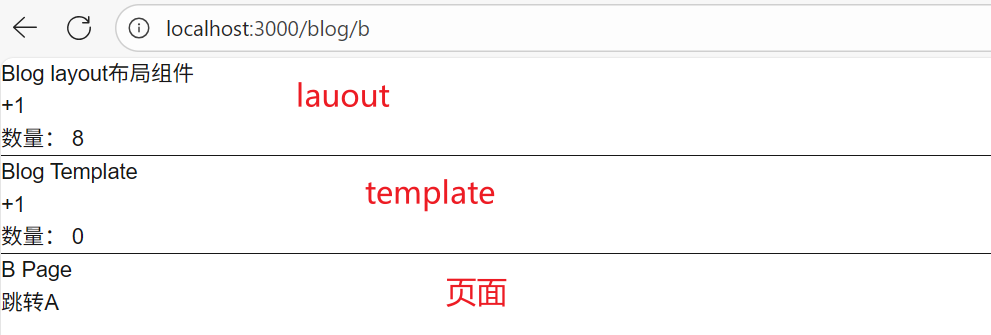
A页面、B页面相互跳转时，layout是不会重新渲染的，但template每次都会重新渲染
## error(错误页)
app/blog/error.tsx
```javascript
'use client' //错误组件必须是客户端组件
export default function Error() {
    return (
        <div>
            <h1>Error</h1>
        </div>
    )
}
```
app/blog/errorTest/page.tsx
```javascript
import Link from "next/link"
export default async function ErrorTest() {
    //遇到异常会自动跳转到error组件
    throw new Error("错误")
    return (
        <div>
            <h1>ErrorTest Page</h1>
            <Link href="/blog/b">跳转B</Link>
        </div>
    )
}
```
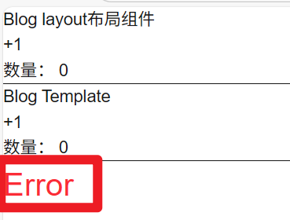
## not-found(404)
其实Next.js 默认会生成一个404页面，但我们可能自定义404页面，只需要在app目录下创建一个not-found.tsx文件即可

app/not-found.tsx
```javascript
export default function NotFound() {
    return (
        <div>
            <h1>404 Page</h1>
        </div>
    )
}
```
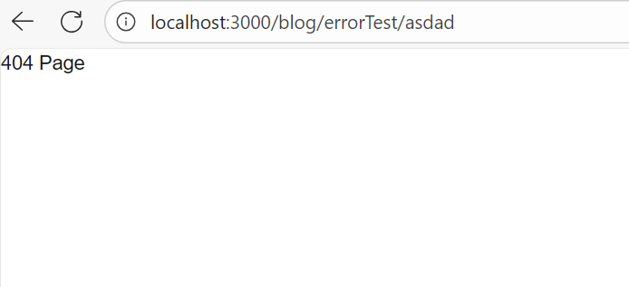
# 路由导航
## Link组件
<Link>是一个内置组件，在a标签的基础上扩展了功能，并且还能用来实现预获取(prefetch)，以及保持滚动位置(scroll)等。
### 基本用法
```javascript
import Link from "next/link" //引入Link组件
export default function Home() {
    return (
        <div>
            <Link href="/about">跳转About页面</Link>
            <Link href={{pathname: "/about", query: {name: "张三"}}}>跳转About并且传入参数</Link>
            <Link href="/page" prefetch={true}>预获取page页面</Link>
            <Link href="/xm" scroll={true}>保持滚动位置</Link>
            <Link href="/daman" replace={true}>替换当前页面</Link>
        </div>
    )
}
```
### 支持动态渲染
```javascript
import Link from "next/link"
export default function Page() {
    const arr = [1, 2, 3, 4, 5]
    return arr.map((item) => (
        <Link key={item} href={`/page/${item}`}>动态渲染的Link</Link>
    ))
}
```
## useRouter Hook (客户端组件)
useRouter 可以在代码中根据逻辑跳转页面，例如根据用户权限跳转不同的页面。

使用该hook需要在客户端组件中。需要在顶层编写 'use client' 声明这是客户端组件。
```javascript
'use client'
// 这个hook只能在客户端组件中使用
import { useRouter } from "next/navigation"
export default function Page() {
    const router = useRouter()
    return (
        <>
        <button onClick={() => router.push("/page")}>跳转page页面</button>
        <button onClick={() => router.replace("/page")}>替换当前页面</button>
        <button onClick={() => router.back()}>返回上一页</button>
        <button onClick={() => router.forward()}>跳转下一页</button>
        <button onClick={() => router.refresh()}>刷新当前页面</button>
        <button onClick={() => router.prefetch("/about")}>预获取about页面</button>
        </>
    )
}
```
## redirect函数 (服务端组件)
redirect 函数可以用于服务端组件/客户端组件中跳转页面，例如根据用户权限跳转不同的页面。

在Next.js中 redirect的状态是：307临时重定向
```javascript
import { redirect } from "next/navigation"
export default async function Page() {
   const checkLogin = await checkLogin()
   //如果用户未登录，则跳转到登录页面
   if (!checkLogin) {
    redirect("/login")
   }
   return (
    <div>
        <h1>Page</h1>
    </div>
   )
}
```
## permanentRedirect 函数
permanentRedirect 跟上面的redirect的区别是：permanentRedirect是永久重定向，而redirect是临时重定向。

在Next.js中 permanentRedirect的状态是：308永久重定向
```javascript
//用法跟redirect一样，只是状态码不同
import { permanentRedirect } from "next/navigation"
export default async function Page() {
   const checkLogin = await checkLogin()
   if (!checkLogin) {
    permanentRedirect("/login")
   }
}
```
## permanentRedirect / redirect 参数说明
```javascript
这两个函数都接受以下参数：

path：字符串类型，表示重定向的目标 URL（支持相对路径和绝对路径）
type：可选参数，值为 replace 或 push，用于控制重定向的行为
关于 type 参数的默认行为：

在 Server Actions 中：默认使用 push，会将新页面添加到浏览器历史记录
在 其他场景 中：默认使用 replace，会替换当前的浏览器历史记录
你可以通过显式指定 type 参数来覆盖默认行为。
```
>  注意：type 参数在服务端组件中无效，仅在客户端组件和 Server Actions 中生效。
## 动态路由
动态路由是指在路由中使用方括号[]来定义路由参数，例如/blog/[id]，其中[id]就是动态路由参数，因为在某些需求下，我们需要根据不同的id来显示不同的页面内容，例如商品详情页，文章详情页等。
### 基本用法[slug]
使用动态路由只需要在文件夹名加上方括号[]即可，例如[id],[params]等，名字可以自定义。

来看demo: 我们在app/blog/c目录下创建一个[id]目录
```javascript
//app/blog/c/[id]/page.tsx

'use client';
// 这个hook只能在客户端组件中使用
import { useParams } from 'next/navigation'
export default function ParamsTest() {
    const params = useParams();
    console.log(params);
    return (
        <div>
            <h1>ParamsTest Page</h1>
        </div>
    )
}
```
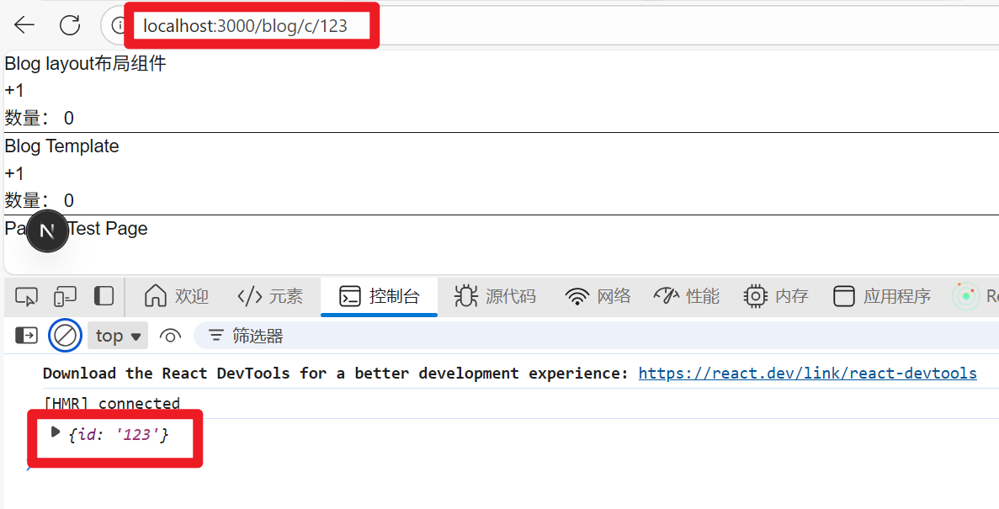
### 路由片段[…slug]
我们如果需要捕获多个路由参数，例如/shop/123/456，我们可以使用路由片段来捕获多个路由参数，他的用法就是[...slug]，其中slug就是路由片段，这个名字可以自定义，后面的片段有多少就捕获多少。
```javascript
//app/blog/d/[...id]/page.tsx

'use client';
// 这个hook只能在客户端组件中使用
import { useParams } from 'next/navigation'
export default function Page() {
    const params = useParams();
    console.log(params);
    return (
        <div>
            <h1>Page</h1>
        </div>
    )
}
```
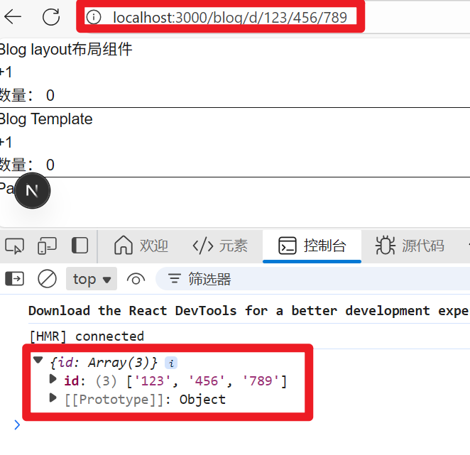
### 可选路由[[…slug]]
可选路由指的是，我们可能会有这个路由参数，也可能会没有这个路由参数，例如/shop/123，也可能是/shop，我们可以使用可选路由来捕获这个路由参数，他的用法就是[[...slug]]，其中slug就是路由片段，这个名字可以自定义，后面的片段有多少就捕获多少。
````javascript
//app/blog/d/[[...id]]/page.tsx
'use client';
// 这个hook只能在客户端组件中使用
import { useParams } from 'next/navigation'
export default function Page() {
    const params = useParams();
    console.log(params);
    return (
        <div>
            <h1>Page</h1>
        </div>
    )
}
````
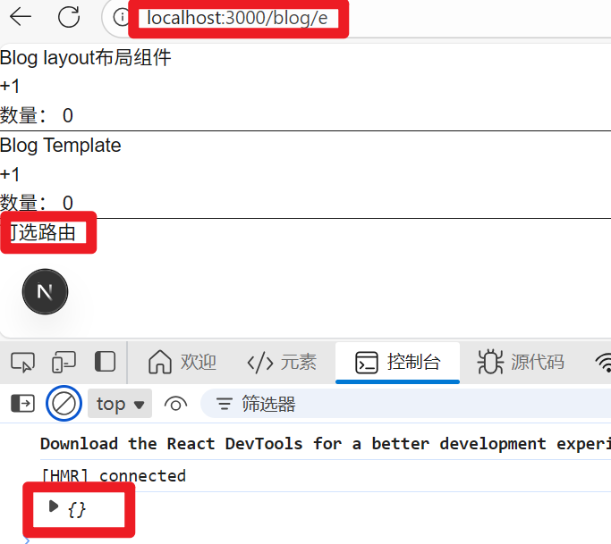

>访问路径为:http://localhost:3000/blog/e可以没有参数
> 
>访问路径为:http://localhost:3000/blog/e/123，可以有参数
> 
>访问路径为:http://localhost:3000/blog/e/123/456，可以有多个参数
## 平行路由
### 平行路由
平行路由的使用方法就是通过@ + 文件夹名来定义，例如@team，@analytics等，名字可以自定义。
```javascript
// app/@team/page.tsx
function TeamPage() {
    return <div>TeamPage</div>
}

export default TeamPage
```
### 在根Layout视图中使用平行路由
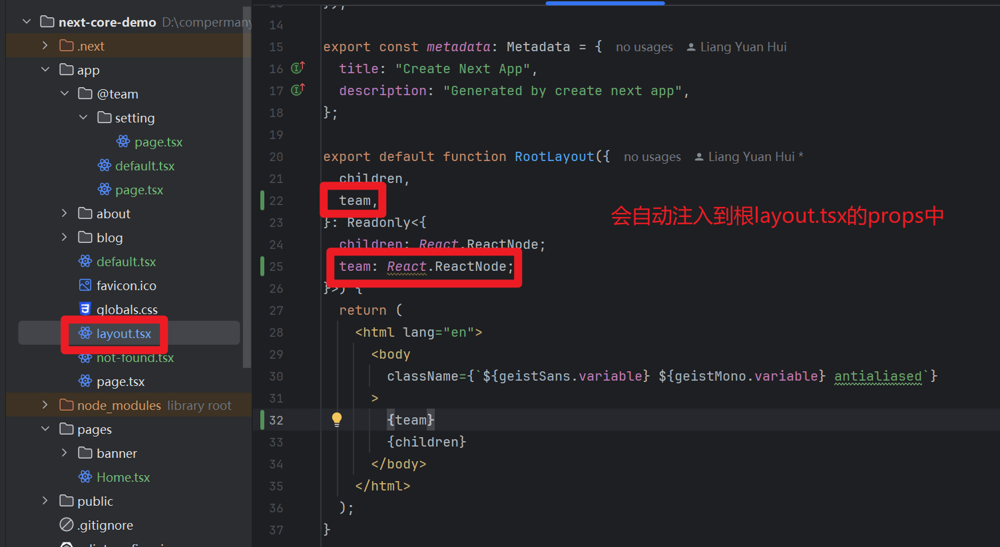
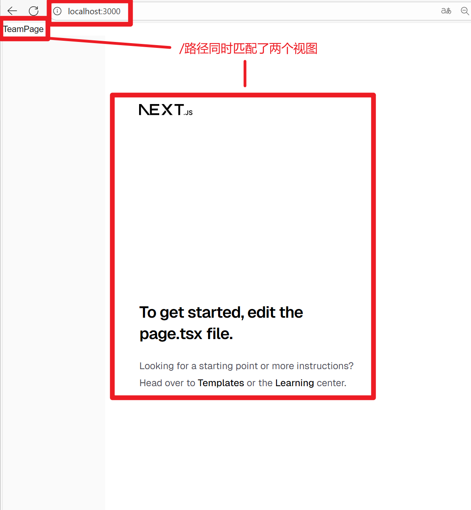
### default.tsx
匹配不到视图时，会使用对应视口下的default.tsx组件

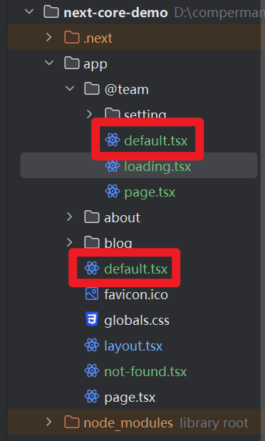
```javascript
export default function TeamDefault() {
    // 某些场景，不用展示任何内容，可以使用<></>
    // return <></>
    return <div>TeamDefault</div>
}
```
### 独立路由
当我们使用了平行路由之后，我们为其单独定义loading,error,等组件使其拥有独立加载和错误处理的能力。
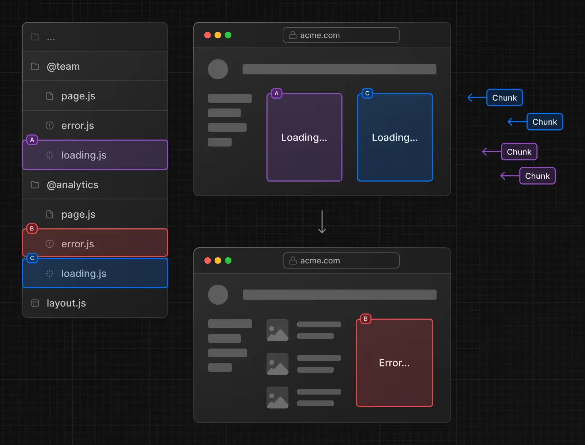
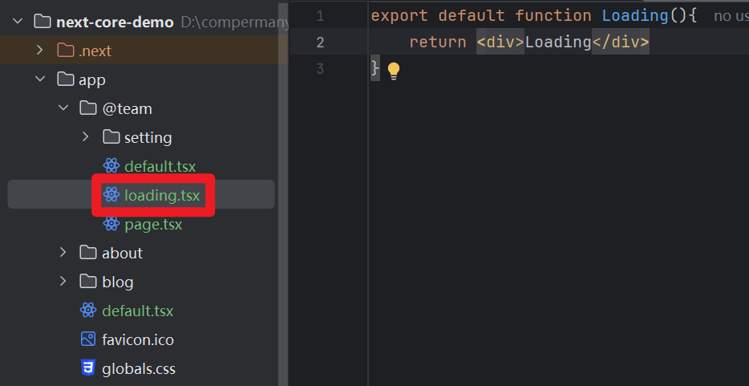
## 路由组
路由组也是一种基于文件夹的约定范式，可以让我们开发者，按类别或者团队组织路由模块，并且不影响 URL 路径。

用法：只需要通过(groupName)包裹住文件夹名即可，例如(shop)，(user)等，名字可以自定义。
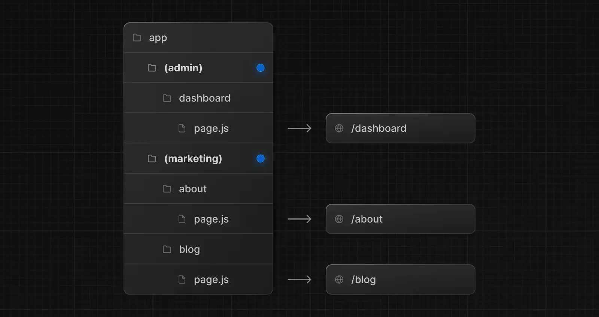
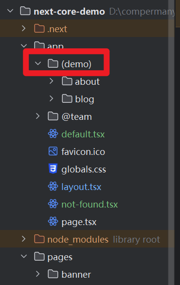

上面的(demo)分类，不影响原先的路由路径，只是为了方便组织路由模块。
### 定义多个根布局
这种一般是大型项目使用的，例如我们需要把，后台管理系统和前台的门户网站，放到一个项目就可以使用这种方法实现。
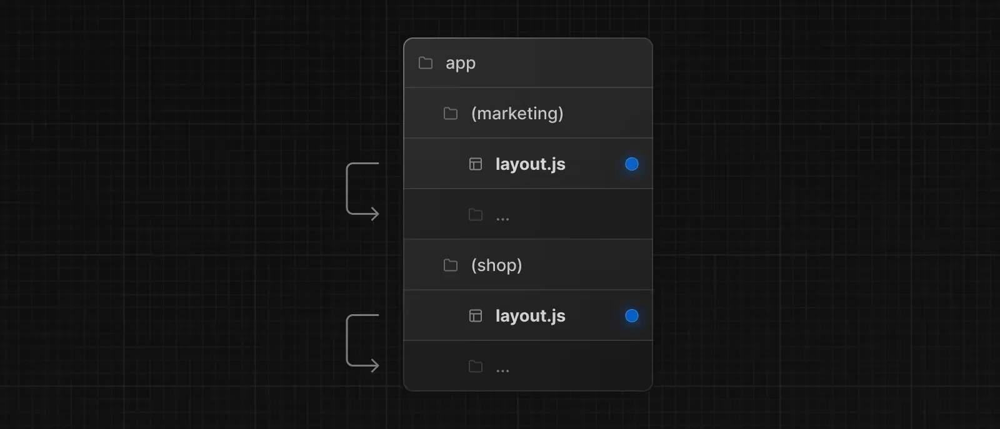
```javascript
使用方法：
先把app目录下的layout.tsx 文件删除
在每组的目录下创建layout.tsx文件，并且定义html,body标签。
```
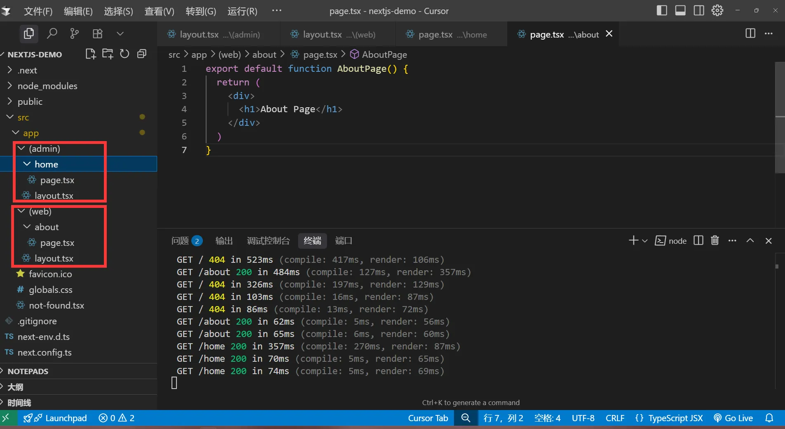
>然后分别访问以上的/home、/about路径查看效果即可
## 路由处理、api编写
直接参考链接：https://nextjs-docs-henna-six.vercel.app/tutorials/route-handling
# Proxy代理/请求拦截
参考链接：https://nextjs-docs-henna-six.vercel.app/tutorials/proxy
# 渲染方式
## CSR
CSR是Client Side Rendering的缩写，即客户端渲染。像我们使用的Vue React Angular 等框架，都是CSR。
### 工作流程
> 浏览器请求服务器 -> 服务器返回HTML/JS/CSS等文件 -> JS动态渲染生成DOM -> 浏览器渲染DOM


### 优点
> 1.交互流畅，可直接响应
> 2.前后端分离，前端注重UI，后端注重数据
### 缺点
> 1. 首屏加载慢，因为需要下载JS/CSS等文件
> 2. SEO不友好，因为JS动态渲染(现在爬虫普遍已经支持JS抓取了)
### 适合场景
> 1. 后台管理系统开发(后台系统不需要SEO，也不需要首屏加载速度)
> 2. 单页面应用开发(SPA)
## SSR
SSR是Server Side Rendering的缩写，即服务端渲染。像我们使用的Next.js Nuxt.js等框架，都是SSR。

例如我们有一个电商网站，需要保证用户搜索关键词能搜到 xx商品, 还要注意 用户还可能是弱网环境,在地铁 电梯等，所以我们可以直接把API放到服务器请求，然后渲染成HTML页面返回给浏览器。
### 工作流程
浏览器请求服务器 -> 服务器(内部调用API接口-> 渲染HTML页面) -> 浏览器直接读取HTML页面 并且 同时加载JS/CSS等文件 -> 执行hydration(水合)
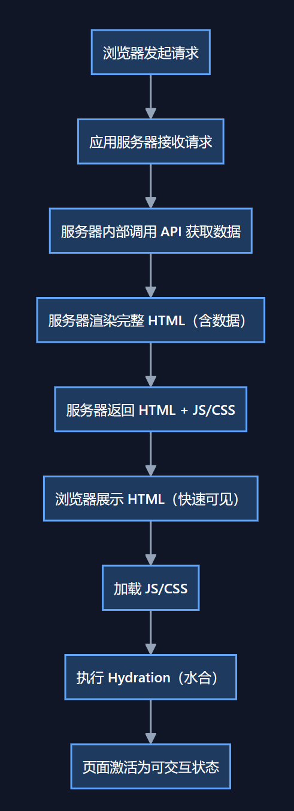
### 优点
> 1. 首屏加载快，因为服务器已经渲染了HTML页面
> 2. SEO友好，搜索引擎能爬取到完整内容
### 缺点
> 1. 开发成本高，需要懂服务端知识，全栈开发。
> 2. 服务器承担渲染工作，如果用户访问量大，对服务器配置要求高，增大成本
### 适合场景
> 1. 电商网站开发
> 2. 博客网站开发
> 3. 官网/首页等
## SSG
SSG是Static Site Generation的缩写，即静态站点生成。像我们使用的Vitepress Astro等框架，都是SSG。

例如我们需要一个查看文档的网站，例如Vue React 等文档，大家看到的都是一样的，所以我们在构建的时候，直接编译成静态文件，连接口都不用请求了，如果在部署CDN/Nginx等服务器，基本可以实现秒开。
### 工作流程
项目构建 npm run build -> 生成静态文件（每个路由对应一个 HTML） -> 部署到CDN/Nginx等服务器 -> 浏览器请求服务器 -> 服务器返回HTML页面 -> hydration

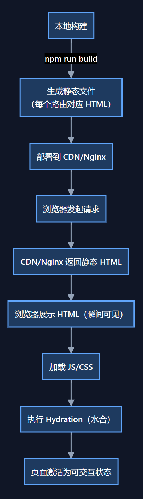
### 优点
> 1. 首屏加载极快（CDN 分发静态文件，无需服务器实时渲染）
> 2. 服务器压力小（CDN 直接承载请求，无需服务器执行 JS）
> 3. SEO 最优（静态 HTML 含完整数据，搜索引擎爬取无压力）
### 缺点
> 1. 不适用于动态数据（数据更新需要重新构建部署，如实时股价、实时评论）
> 2. 详情页面如果过多(构建时间会长)
### 适合场景
> 1. 技术文档
> 2. 静态营销页
> 3. 静态新闻站
# Hydration(水合)
简单来说就是HTML他是静态的，需要通过JS才能变成动态的，不然HTML是没有任何交互效果的，当JS下载完成在赋予HTML交互效果的阶段称之为水合。
## Next水合详细流程
### 服务端操作
```text
Next.js 服务器接收到用户请求。
服务器执行 React 组件代码，获取数据（比如从 API 接口请求文章列表）。
服务器将 React 组件渲染成静态 HTML 字符串（包含了文章列表的所有内容）。
服务器将这个 HTML 字符串返回给浏览器。
```
### 客户端
```text
浏览器接收到 HTML，立即解析并展示给用户（此时用户能看到文章列表，但点击 “查看详情” 按钮没有反应）
浏览器开始下载页面所需的 JS 文件（包括 React 核心库、组件代码等）
JS 下载完成后，React 会执行 ReactDOM.hydrateRoot() 方法（在 React 18+ 中）
hydrateRoot() 会对比浏览器中的真实 DOM 和 React 组件的虚拟 DOM：
如果结构一致，React 会给真实 DOM 绑定事件监听器。
如果发现差异（比如服务器和客户端数据不一致），React 会发出警告，并以客户端渲染的结果为准。
水合完成后，页面变成可交互的动态页面（用户可以点击按钮、滚动加载更多内容等）
```
# RSC(减少bundle体积、避免全量水合)
区分服务器组件和客户端组件

链接：https://nextjs-docs-henna-six.vercel.app/tutorials/rsc
## 优点
> 1. 将组件拆分成客户端组件和服务器组件，可以有效的减少bundle体积，因为服务器组件已经在服务器渲染好了，所以没必要打入bundle中,也就是说服务器组件所依赖的包都不会打进去，大大减少了bundle体积。
> 2. 局部水合，像传统的SSR同构模式, 所有的页面都要在客户端进行水合，而RSC将组件拆分出来，只会把客户端组件进行水合，避免了全量水合带来的性能损耗。
> 3. 流式加载，我们的HTML页面本来就支持流式加载，所以服务器组件可以边渲染边返回，提高了FCP(首次内容绘制)性能。

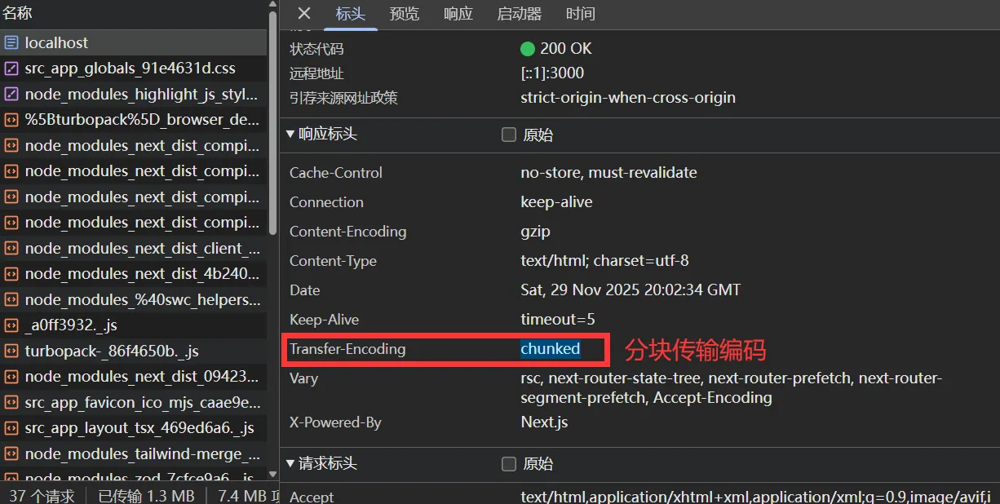
# Server Components
链接：https://nextjs-docs-henna-six.vercel.app/tutorials/server-components
# Client Components
> 注意客户端组件会在服务端进行一次预渲染，所以访问document window 等API需要在useEffect中访问

链接：https://nextjs-docs-henna-six.vercel.app/tutorials/client-components

# 在执行代码过程中，判断客户端环境
```javascript
const isBrowser = typeof window !== 'undefined';
if (isBrowser) {
  console.log('isBrowser');
}
```
# 多环境配置
## 创建.env.development、.env.production文件
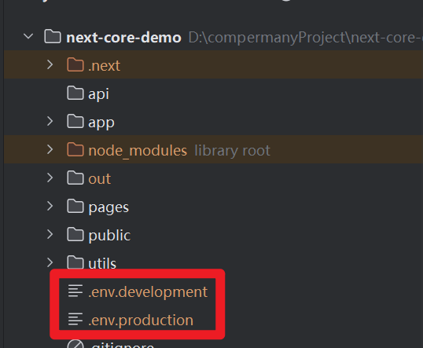
```javascript
//.env.development
NEXT_PUBLIC_SERVER_URL=http://localhost:3000
```
```javascript
//.env.production
NEXT_PUBLIC_SERVER_URL=http://localhost:3666
```
## 为环境变量添加类型声明
### 在根目录创建modules.d.ts

```javascript
declare namespace NodeJS {
    interface ProcessEnv {
        NEXT_PUBLIC_SERVER_URL?: string;
    }
}
```
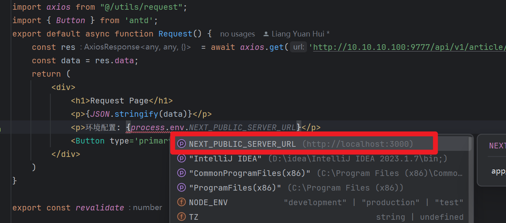
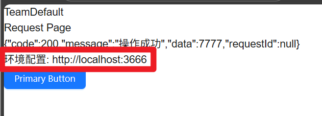
# 网络请求
## fetch
```javascript
// fetch
fetch(url)
    .then(res => { // 第一层res
        res.json() // 需要json过后才是我们想要的数据
            .then(r => { // 第二层res        
               console.log(r) // 获取到最后数据       
        })
});
```
### 缺点
> 1. 获取数据的方式需要两层
> 2. fetch只对网络请求报错，对400，500都当做成功的请求
> 3. fetch不会携带cookie，需要添加配置
> 4. fetch不支持timeout ...
## axios
### 安装依赖
```javascript
pnpm install axios
```
### 封装axios
```javascript
import axios, { InternalAxiosRequestConfig, AxiosResponse, AxiosError } from 'axios'
import { showMessage } from '@/utils/index'
const baseURL = "";
const service = axios.create({
    baseURL: baseURL,
    timeout: 60000,
    headers: {
        'content-type': 'application/json; charset=utf-8'
    }
})

// 异常拦截处理器
const errorHandler = (error: AxiosError) => {
    if (error.response) {
        //以下的showMessage仅在客户端生效
        switch (error.response.status) {
            case 401:
                // 登录过期错误处理
                showMessage("登录过期，请重新登录", 'error', 3000);
                break;
            case 500:
                // 服务器错误处理
                showMessage("服务器错误，请联系管理员", 'error', 3000);
                break;
            case 503:
                // 服务器错误处理
                showMessage("服务器错误，请联系管理员", 'error', 3000);
                break;
            case 404:
                showMessage("请求的资源不存在", 'error', 3000);
                break;
            default:
        }
    }
    return Promise.reject(error);
};

service.interceptors.request.use((config: InternalAxiosRequestConfig) => {
    config.headers = config.headers || {};
    // if (getToken()) {
    //     // 判断是否存在 token, 如果存在的话, 则每个 http header 都加上 token
    //     config.headers['Authorization'] = "Bearer " + getToken()
    // }
    return config;
}, errorHandler)

service.interceptors.response.use((res: any) => {
    return new Promise(async (resolve, reject) => {
        if (res.data.code == 403) {
            //仅在客户端生效
            showMessage("权限不足，请联系管理员", 'warning', 3000);
            return reject(res);
        }
        if (res.data.code == 500) {
            //仅在客户端生效
            showMessage("服务器错误，请联系管理员", 'error', 3000);
            return reject(res);
        }
        if (res.data.code == 200) {
            //仅在客户端生效
            showMessage("请求成功", 'success', 3000);
            if (res.data.data && res.data.data.code === 200) {
                return resolve(res.data.data)
            }
        }
        return resolve(res);
    })
}, errorHandler)

export default service
```
## 注意事项
### 1.不管你用的是axios还是fetch，都不会对ISR增量更新相关功能产生任何影响
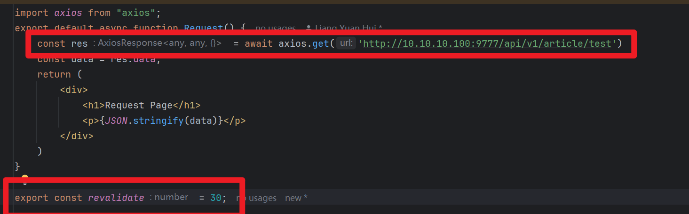
# 整合ui.shadcn组件库
官方文档链接：https://ui.shadcn.com/docs/installation/next

> 因为该组件库是直接安装在项目components目录中的，很方便我们进行组件样式的修改，需要的可以选择安装
# 整合Ant design UI库
官方文档链接：https://ant.design/docs/react/use-with-next-cn

## 注意事项
### 1.如果你在 Next.js 当中使用了 App Router, 并使用 antd 作为页面组件库，为了让 antd 组件库在你的 Next.js 应用中能够更好的工作，提供更好的用户体验，你可以尝试使用下面的方式将 antd 首屏样式按需抽离并植入到 HTML 中，以避免页面闪动的情况。
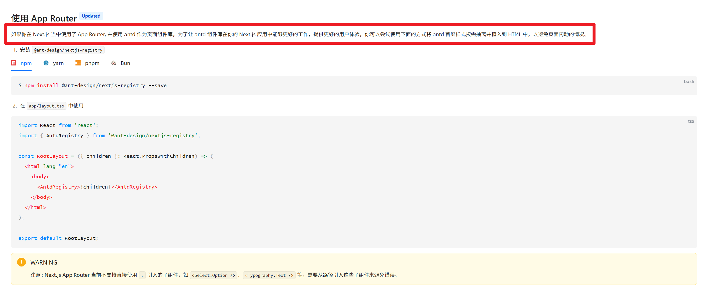
### 2.在服务端不能使用组件库中涉及客户端相关API的组件，否则会报错，比如全局message组件
# 部署打包模式
## 默认模式
在App路由中设置generateStaticParams函数(可在普通页面、layout页设置)，在生产环境下，指定的静态路径不会触发页面函数逻辑的执行，静态路径以外的才会触发页面函数逻辑的执行。
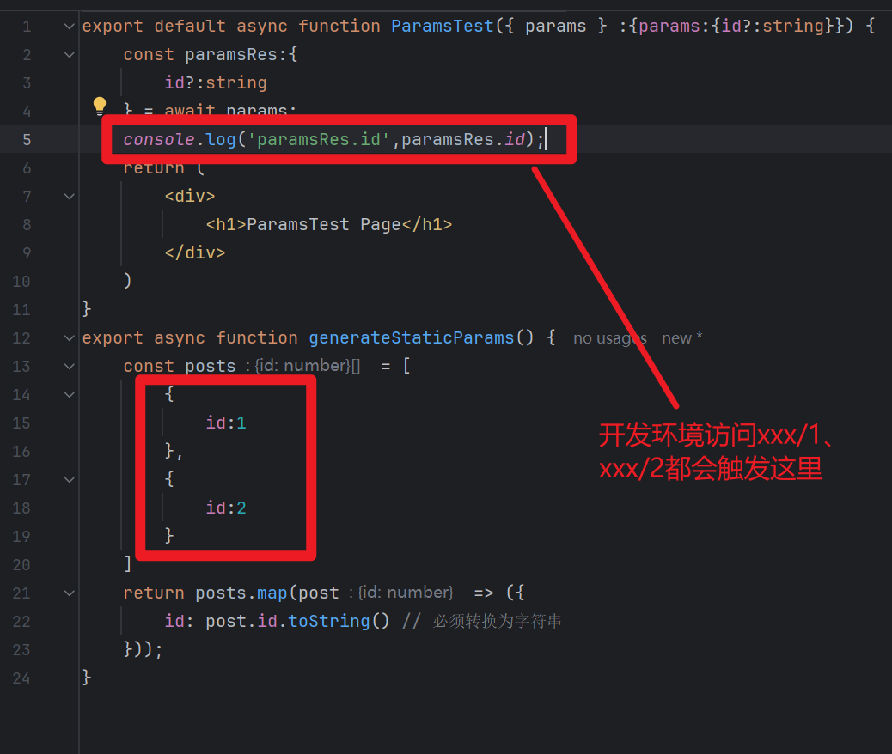

生产环境，除了1、2，其他都会触发

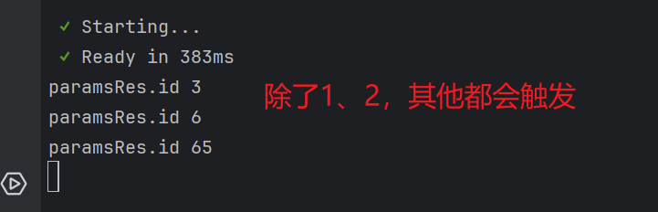
### 打包项目
```javascript
npm run build
```
打包完成后，需要拷贝.next、node_modules、public、package.json四个文件到服务器
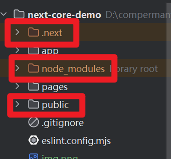

### 运行项目
```javascript
pnpm start
```
## export模式（静态打包）
前面说了默认打包，需要node.js环境和拷贝node_modules文件夹，如果我们只用了next.js静态部分，没用到api服务，官方提供了静态打包方式。

对于动态路由页面，必须使用generateStaticParams函数来生成静态参数，且generateStaticParams不能与'use client'同时存在,否则会报错。

此模式，打包出来纯静态文件，设置ISR的revalidate：xxx相关参数均无效
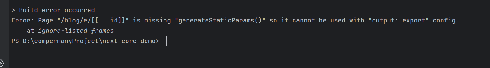
```javascript
export async function generateStaticParams() {
    const posts = [
        {
            id:1
        },
        {
            id:2
        }
    ]
    return posts.map(post => ({
        id: post.id.toString() // 必须转换为字符串
    }));
}
```
### 配置output模式
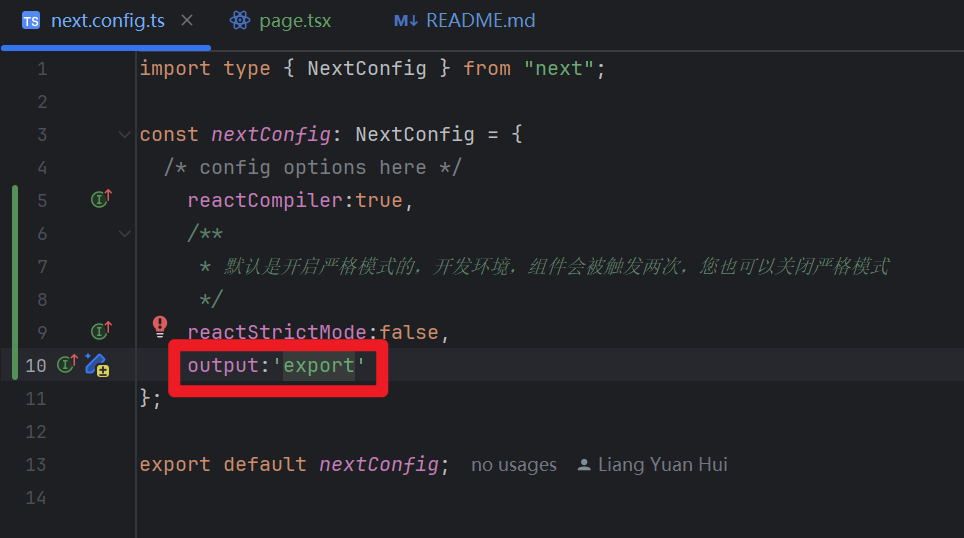
### 打包
```javascript
pnpm build
```
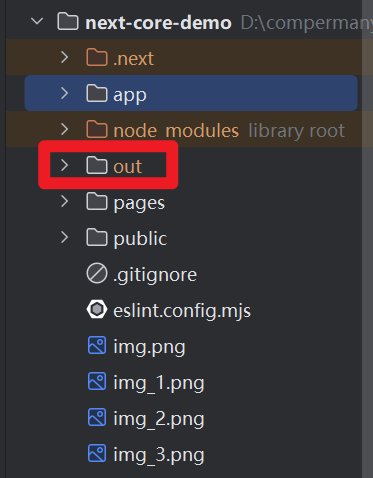

打包完，会在根目录生成out目录用于部署
## standalone模式
需要拷贝static到standalone/.next文件夹下，拷贝外层public文件夹到standalone下
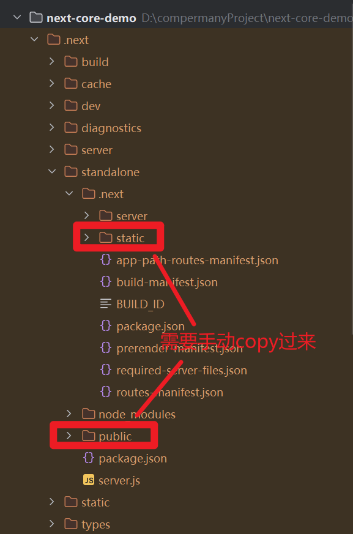
### 配置standalone模式
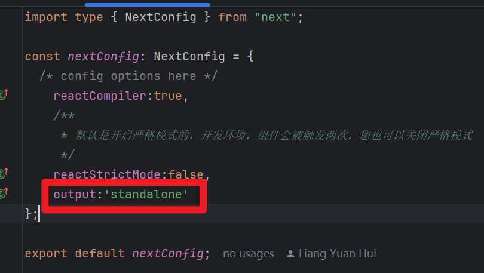
### 自定义build:standalone指令
为了方便，可以自定义build:standalone指令
```javascript
"scripts": {
    "dev": "next dev",
    "build": "next build",
    "build:standalone": "next build && pnpm move-static && pnpm move-public",
    "move-static": "xcopy /e /i .next\\static .next\\standalone\\.next\\static",
    "move-public": "xcopy /e /i public .next\\standalone\\public",
    "start": "next start",
    "lint": "eslint"
},
```
### 打包
```javascript
pnpm build:standalone
```
打包完成后的目录，如下图框起来的范围
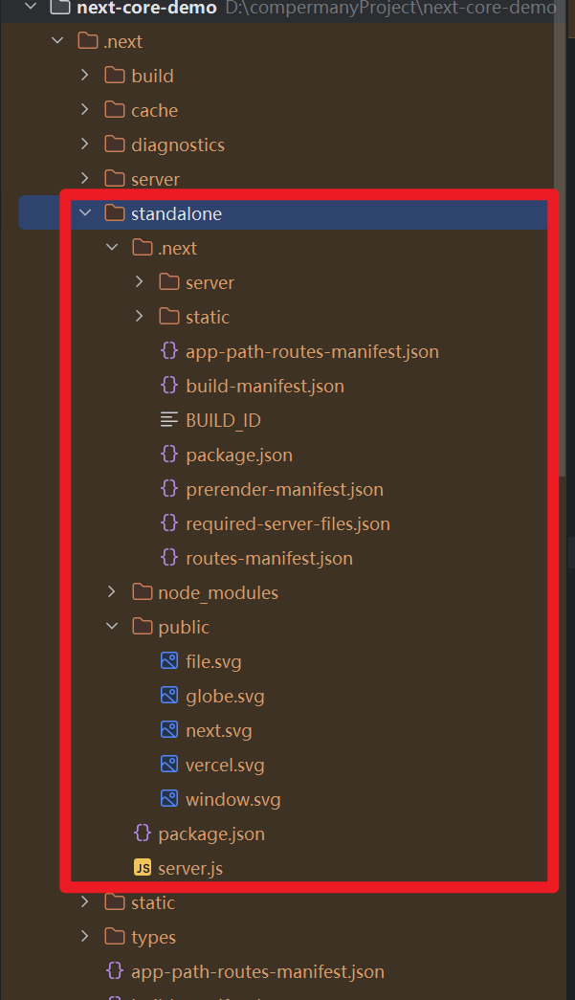
### 运行项目
进入standalone目录，运行以下命令即可
```javascript
node server.js
```
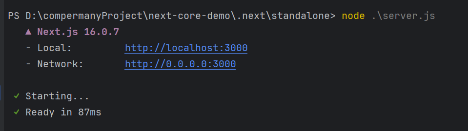
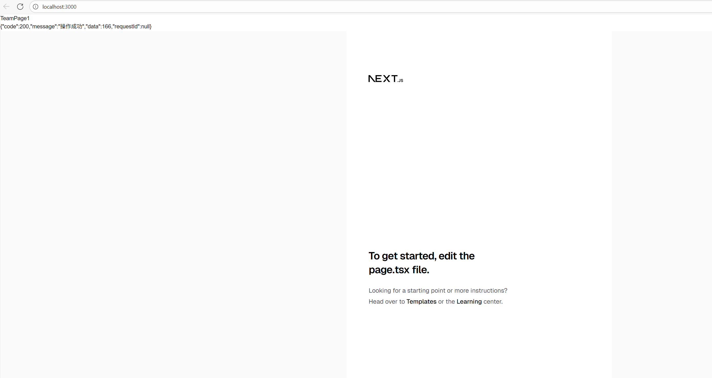
# 对比各个渲染模式
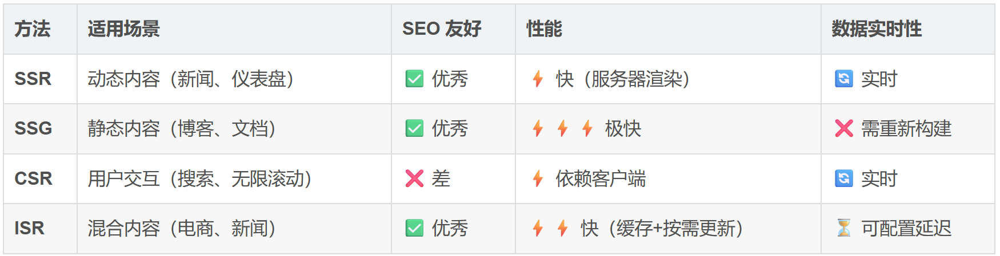

# 最佳实践
> 1.不要滥用 "use client"，将组件职责划分清清楚。仅在必要时使用客户端组件。

> 2.合理使用 loading/error/template 提高用户体验。

> 3.服务端组件只负责请求数据和结构输出，不负责交互。

> 4.需要交互的部分才抽离为客户端组件，避免客户端负载过重。
> 

# meta元数据设置
原先的 Pages 路由，元数据都是通过 next/head 编写在组件中的。
## 静态
```javascript
export const metadata = {
  title: '首页标题',
  description: '首页描述',
  keywords: '首页关键词',
  openGraph: {
    title: 'OG 标题',
    description: 'OG 描述',
    url: 'https://example.com/page',
    images: [{ url: '/og.png' }],
  },
  twitter: {
    title: 'Twitter 标题',
    description: 'Twitter 描述',
    images: [{ url: '/twitter.png' }],
  },
  robots: {
    index: true,
    follow: true,
    googleBot: {
      index: true,
      follow: true,
    }
  },
  manifest: '/manifest.json',
  alternates: {
    canonical: '/',
    languages: {
      'zh-CN': '/zh-cn',
    },
  },
  viewport: {
    width: 'device-width',
    initialScale: 1,
    maximumScale: 1,
  },
  // ...
}

export default function HomePage(){
  return (
    <div>
      首页
    </div>
  )
}

```
## 动态
```javascript
export async function generateMetadata() {
  return requestHomeMetadata()
    .then(response => response.json())
    .then(raw => {
      // todo ...
      return raw
    })
    .then(data => {
      return {
        title: data.title,
        description: data.description
      }
    })
}

export default function HomePage(){
  return (
    <div>
      首页
    </div>
  )
}

```
# 注意事项
## 1.APP路由系统新建的页面，比如页面a,需要建个名为a的目录，然后再在a目录里建个page.tsx文件，这样就可以访问到/a路由了，切记不能直接建立a.tsx文件,不会生成对应的路由。
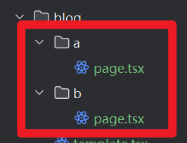
## 2.在开发环境设置revalidate参数，不会生效
## 3.不设置revalidate参数，打包部署后，默认就是静态内容（打包那一刻的内容），每次访问时，不会请求后端接口进行更新(因为fetch默认就是缓存的)，想要每次请求，都在服务端重新请求数据渲染，需要在页面函数中显式的设置revalidate参数，设置为0或者配置即可。
或者配置
```javascript
// 禁止缓存（强制动态）
export const dynamic = 'force-dynamic';
```
或者给fetch配置'no-cache'
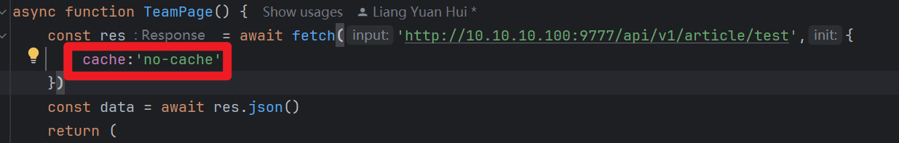
## 4.默认打包模式下，首次打包过后，会有缓存，导致下次打包时，不会请求后端接口获取新的数据，导致使用旧的seo信息，所以最好在每次打包前都把.next目录删除，重新打包。
## 5.Nuxt是默认刷新页面请求一次，就在后端渲染最新数据内容，Next默认是打包构建那一刻对于服务端侧的内容，就进行了预渲染，后续刷新页面再次访问时，不会再请求后端接口，而是直接使用缓存的内容。
## 6.use client情况下，不能使用revalidate参数
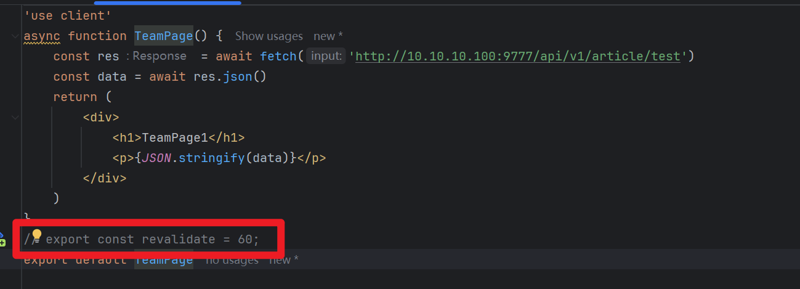
## 7.目前在next16版本下，使用'use client',结合以下方式请求后端接口，会导致无限循环请求后端接口
客户端组件用于交互，异步逻辑通过useEffect实现，不能直接定义为异步函数本身。
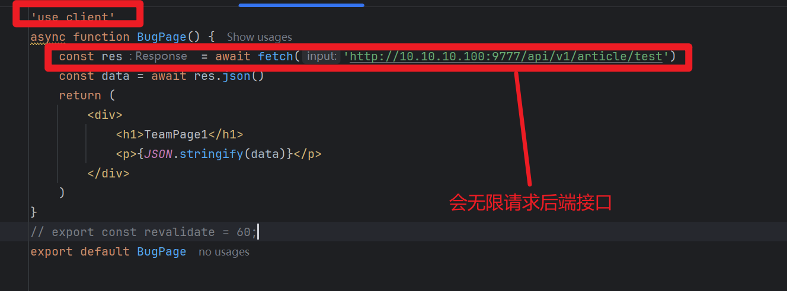
## 8.useParams与async语法糖不能同时使用
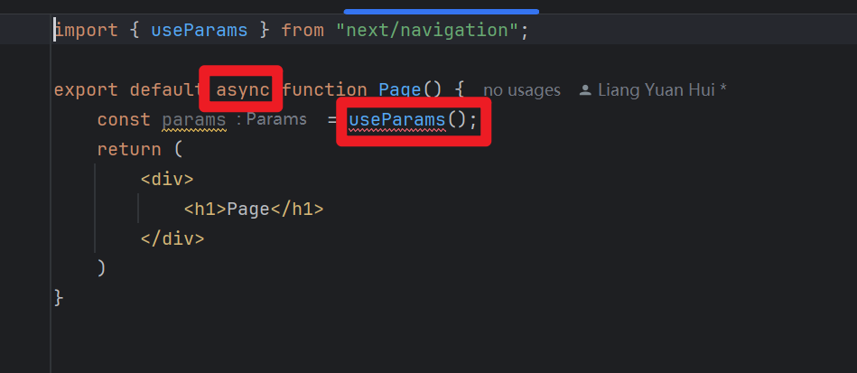
## 9.如果既想拿到路由参数的同时，又想拥有ssr的效果（每次请求都返回最新的数据），可以async await + props + 'force-dynamic'
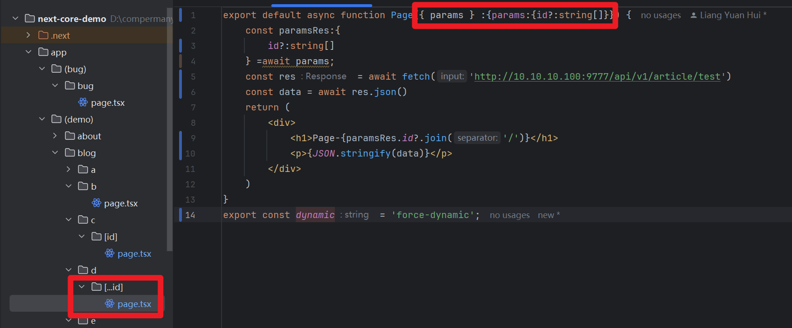
## 10.ISR (配置了revalidate参数)，增量更新用户是无感知的（到达更新缓存的时间时，如果后端接口响应缓慢，前端是不会显示loading的，即使你配置了loading模板）
## 11.在 App 路由中，没有 getStaticPaths，取而代之的是 generateStaticParams 函数。
如果需要 getStaticProps，则在页面组件中直接 fetch 即可（页面必须是服务端组件才能够直接 fetch）
## 12.Pages路由与App路由的useRouter区别
>与 Pages 路由不同，App 路由虽然也使用 useRouter，但是是从 next/navigation 中导入的，而不是 Pages 路由的 next/router。

>原先的 Pages 路由的 useRouter 提供的 query、pathname 等属性在 App 路由中不存在，取而代之的是需要从 next/navigation 导入的 useSearchParams，usePathname 等 API。

>且需要注意，App 路由和 Pages 路由的 useRouter 是不兼容的。

## 13.next.js，在执行默认模式打包时，可能会因为管理员权限而报错，切到管理员权限再进行打包即可